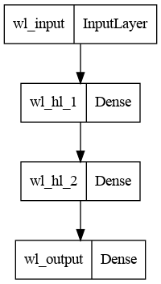

# NHL_betting_model
A repository to host my personal efforts to develop a profitable betting system on NHL games using neural networks.

## Introduction
This repository contains the results of my personal exploration into the development of a profitable betting model using deep learning. My goal is to design and implement a custom deep learning model, trained only on publicly available data, that can predict the win probability of NHL teams accurately enough to bet profitably. My models also have customized loss functions that simulate the growth and decay of a bankroll after continued betting, forcing the model to use good bankroll management practices. 

## Data
All of the data used within this project is publicly accessible and regularly updated. The base dataset used is from [MoneyPuck](https://moneypuck.com/) and contains game-wide features, such as shot counts, save percentages, goals, and some advanced derived statistics such as corsi and fenwick. The MoneyPuck data is supplemented with data from the NHL api, which I use for play-by-play data. This allows the model to incorporate player-specific statistics and provides knowledge towards game lineups and playing times. Historic odds data, required for back testing the betting models, is downloaded from [sportsbookreviewsonline](https://www.sportsbookreviewsonline.com/).

Importantly, this model uses closing odds for back testing the betting model. Closing odds are the odds immediately before the game begins, while opening odds are the initial lines posted before bettors have placed bets. Closing odds are generally more accurate than opening odds, as they are refined by continued betting from the public. This allows the sportsbook to adjust from improper initial odds and makes profitable betting more difficult. If this betting model was to be used in practice, it is assumed the user would not always have the ability to immediately bet on opening odds. Therefore, we must ensure that it is back tested on the most difficult odds subset possible (closing odds). 

## Methods
The primary focus of this project is to use deep learning models, supplemented with customized loss functions, to select profitable bets on NHL games. As such, a personalized neural network architecture has been designed for the type of data inputted to the model. 

The first fundamental learning problem is for the model to accurately assess the win probability between two teams playing each other. A straightforward approach to this is shown in [standard_wl_model.ipynb](standard_betting_model.ipynb), where a standard 2-hidden-layer dense network is trained to output a single value (with a sigmoid activation).  This relatively small network contains ~600 trainable parameters. The image below summarizes the network’s architecture:

  

This single output represents the predicted probability that the home team will win the game. The loss function used here is binary cross-entropy, as this is a standard classification task. Because these networks are relatively small (with larger networks suffering from overfitting), it is easy to use them in ensemble. In the referenced notebook, both standard voting and mean-based voting are implemented to improve accuracy. 

The second learning problem is for the model to decide how to act upon the predicted win probability information. This is bankroll management learning, which must compare the predicted win probabilities with the betting odds to calculate valuable opportunities while managing risk exposure. This problem was not trained in isolation, but within the context of a win prediction model. The model summary below shows the bankroll management network:

[standard_betting_model.ipynb](standard_betting_model.ipynb) shows how this model is defined and trained. There are two branches to the bankroll management model: a computational branch and a learning branch. 

The computational branch processes input data using `wl_avg_model`, which consists of multiple pretrained win-loss models (referenced HERE) that are averaged to provide a win-loss probability for the given game. This probability, along with betting odds, are passed to a lambda layer that computes the Kelly criterion of the betting opportunity. Derived from probability theory, the Kelly criterion is the mathematically optimal percentage of your total bankroll to place on a gambling opportunity, given exact knowledge of the return and outcome probabilities. In reality, we understand our win-loss probabilities are not exactly correct, so it would be inappropriate to strictly follow the computed Kelly criterion. However, it is assumed to be a useful metric in approximating how valuable a betting opportunity is. Therefore, it is explicitly provided to the network. 

KELLY EQUATION HERE

The learning layer consists of dense layers that process both the main and the odds inputs. The learning layer is concatenated with the computational layer, and both are processed through a hidden layer for the final model output. 

The specific output template for this model has been experimented with and iterated over. Originally, two output nodes with a SoftMax activation function were used to represent the probability of the home and away teams winning, respectively. However, testing suggested that a single output node with a sigmoid activation function allowed the model to learn more effectively. Eventually, a second output was adopted that behaved as a should-bet option (also with a sigmoid activation). This helped to provide stability to the model but showed no noticeable performance improvements. The likelihood of a bet being placed can be controlled by the threshold value associated with that node. 

The most important stage in this project was the development of an appropriate loss function. Design of the loss function was centered on forcing the model to correctly manage a finite bankroll, and to reward bankroll growth. This was done by simulating a betting sequence for each training batch. For example, assume a batch size of 64. When training, the model would output bets for all 64 games (whether to bet home or away, and how much to bet). The loss function computation would begin with a simulated bankroll amount and would iterate through each bet. If the bet was on the winner, the bankroll would grow by the bet amount multiplied by the betting odds. If the bet was on the loser, the betting amount would be subtracted from the bankroll. 

The final bankroll amount after each game has been iterated over is indicative of the success of the model. Experimentally, it was found that the model had trouble using the actual bankroll value (or net return) as the actual loss value. Instead, the interest rate value (see below) of the betting return was computed and used. 

INTEREST EQUATION HERE

Three flavours of the bankroll loss function were tried: straight unit betting, confidence unit betting and fractional betting. Straight unit betting assumes a constant bet size, regardless of the model’s confidence in the bet and the current bankroll size. Confidence unit betting does not change the bet amount with bankroll growth/shrinkage but does scale the bet size based on the model’s confidence. Fractional betting treats the model output as the fraction of the total bankroll to bet, which changes with model confidence in the bet and with bankroll size. 

## Results
In the end, this project was unable to demonstrate consistently profitable behaviour. Win prediction models were able to achieve accuracy values ~61% on testing datasets, which agrees with standard literature values for machine learning predictions for NHL games. This accuracy value was not 

Examples of model performance on unseen data are shown below. 

## Next Steps
In the future, there are a couple of ways in which I would like to extend this analysis. To begin, the analysis of current work in the field should be redone. My original exploration into existing work was over a year ago (late 2021), and much can be expected to have changed since then. Specific attention should also be paid to data sources and data formatting, as this was found to be the most important aspect of model development. Even with the most appropriate architecture and loss function, if the underlying data is not sufficient to create accurate predictions, there will be no opportunity for success. Lastly, a general review of the loss functions and model architectures experimented with should be completed. This stage of the project should be well documented and provide logical insight towards design decisions for a final model. Currently, many of the design items iterated over were done informally and should be done scientifically and rigorously. 
